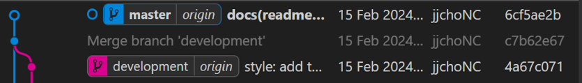

# Level1 : Back To Basic

## Penugasan

1. Buat sebuah repository di GitHub. Nama repository dalam format ajk-[nama panggilan]-penugasan1. Repository ini juga sebagai tempat menaruh laporan pengerjaan untuk level selanjutnya.
Contoh: ajk-nur-penugasan1
Struktur: 
```
/src			(Berisi kode pengerjaan level 1 kalian)
README.md		(Readme utama)
level-1.md		(Laporan level 1)
level-2.md		(Laporan level 2)
level-3.md		(Laporan level 3)
level-4.md		(Laporan level 4)
```
2. Implementasikan penggunaan branching yang terdiri dari master, development, featureA, dan featureB. Codebase dibebaskan.
Implementasikan intruksi git untuk push, pull, stash, reset, diff, dan merge. Adanya tambahan intruksi git selain yang disebutkan akan lebih baik.

3. Implementasikan sebuah penanganan conflict di branch development ketika setelah merge dari branch featureA lalu merge dari branch featureB. 
Catatan: conflict bisa terjadi jika kedua branch mengerjakan di file dan line code yang sama. Buatlah skenario sendiri.

4. Gunakan merge no fast forward.

Buat dokumentasi pengerjaan kalian (level-1.md) yang setidaknya meliputi:
- Alur pengerjaan (sesuai dengan nomor soal)
- Penjelasan dari setiap alur
- Screenshot (atau record)
- Kondisi git graph (git log)
- Kendala atau kesulitan

---------------------
## Pengerjaan
### 1. Pembuatan Repository GitHub
Untuk membuat repository git, kita perlu menginisialisasi git didalam direktori yang akan digunakan sebagai _local repository_ dengan perintah `git init`.  Setelah itu tambahkan direktori dan files sesuai dengan struktur file pada perintah soal.

Setelah melakukan inisialisasi dan penambahan files dan direktori, gunakan `git add .` untuk menambahkan perubahan ke _stagging area_ lalu commit menggunakan `git commit -m "message"` dengan commit message sesuai dengan [_conventional commit message_](https://gist.github.com/qoomon/5dfcdf8eec66a051ecd85625518cfd13). Maka file sudah ditambahkan ke repositori lokal, selanjutnya untuk membuat _remote repository_ kita bisa langsung membuatnya pada [GitHub](https://github.com/new). Setelah itu jalankan perintah yang ada. Untuk selengkapnya bisa dilihat pada gambar dibawah ini.


### 2. Implementasi Branching
Pertama-tama untuk membuat branch kita bisa menggunakan `git branch <branch_name>`. Namun disini saya menggunakan `git checkout -b <branch_name>`, perintah tersebut akan membuat branch baru dan akan berpindah ke branch yang baru dibuat. Pada kasus ini saya membuat dahulu branch development dan melakukan perubahan pada file `src/index.html` lalu melakukan commit dan push seperti dibawah. 

Karena pada soal juga diminta untuk menambahkan branch featureA dan featureB disini saya menggunakan perintah checkout yang telah dilakukan sebelumnya untuk membuat branch featureA dan featureB.

Setelah branch featureA dan featureB telah dibuat, saya mencoba untuk melakukan commitan fitur pada masing-masing branch yang nantinya akan di merge dengan _branch_ development.


### 3. Implementasi Instruksi Git
Banyak implementasi instruksi Git yang saya gunakan disini, yang pertama ada instruksi `git push` yang saya gunakan untuk mengirimkan commitan file dari _local repository_ ke _remote repository_


Selain itu saya juga mengimplementasikan instruksi `git diff` yang saya gunakan untuk membandingkan perubahan/perbedaan antar branch, untuk membandingkan kedua branch tersebut saya menggunakan instruksi `git diff <branch1> <branch2>` yang mana pada kondisi ini saya menggunakan instruksi `git diff master development" yang akan membandingkan branch master dan development.


Saya juga mengimplementasikan penggunaan `git stash` yang mana akan mengkarantina/menyembunyikan perubahan pada _branch_ dan dapat berpindah ke _branch_ lain tanpa perlu melakukan commit. Untuk mengembalikan perubahan tersebut kita bisa menggunakan `git stash pop`.


Tidak hanya itu, dalam repository ini juga mengimplementasikan penggunaan `git merge`. Disini saya menggunakan perintah `git merge --no-ff` yang mana akan membuat merge commit baru. Berikut adalah gambaran _git graph_ sebelum dan sesudah dilakukan merge.


Karena saya lupa ada beberapa instruksi yang belum saya coba. Pada bagian **akhir** pengerjaan pada repository ini, saya juga mencoba instruksi `git reset`, `git restore`, dan juga `git pull`. Sebelum mencobanya saya melakukan commit dan juga push pada branch master (sudah termerge dengan branch development) dengan melakukan perubahan pada file readme.



Setelah itu saya menggunakan perintah `git reset HEAD~` untuk melakukan _reset_ pada commitan terbaru dan menghasilkan kondisi git graph seperti dibawah


Setelah itu saya menggunakan instruksi `git restore .` untuk memulihkan perubahan yang ada pada _branch_ master sehingga menyebabkan _branch_ remote origin/master lebih maju satu commitan dibandingkan _branch_ pada local.


Dari gambar diatas terlihat bahwa perubahan yang sudah saya push ke remote tidak ditemukan pada repository lokal. Sehingga perlu dilakukan instruksi `git pull origin master` untuk menarik perubahan dari branch master di remote ke branch master di lokal.


Dapat dilihat bahwa kondisi HEAD sudah sama dengan kondisi _branch_ master pada remote dan juga perubahan pada file readme sudah terlihat.

### 4. Penjelasan Penanganan Conflict Pada Git
Instruksi [`git merge`](https://github.com/jjchoNC/ajk-jericho-penugasan1/blob/master/level-1.md?plain=1#L58) yang saya lakukan sebelumnya membuahkan konflik karena saya melakukan perubahan pada file yang sama di line yang sama saat melakuakn perubahan pada featureA dan featureB.


Untuk menyelesaikannya depat menggunakan opsi **Accept Current Changes**, **Accept Incoming Changes**, **Accept Both Changes**. Karena dalam kasus ini saya ingin memasukan kedua featureA dan featureB sehingag saya menggunakan opsi **Accept Both Changes** yang mana akan otomatis membuat baris baru dan menggabungkan kedua perubahan featureA dan featureB. Setelah itu pilih **Resolve in Merge Editor** dan **Complete Merge** lalu lakukan commit dan push ke remote.


### 5. Penjelasan Merge No Fast Forward
Penggunaan [`git merge`](https://github.com/jjchoNC/ajk-jericho-penugasan1/blob/master/level-1.md?plain=1#L58) pada _line_ tersebut menggunakan opsi `git merge --no-ff`.


`git merge --no-ff` ini berbeda dengan instruksi git merge biasannya. Instruksi `git merge` secara default menggunakan opsi `git merge --ff` yang mana jika kondisinya memungkinkan untuk dilakukan _merge fast forward_ maka tidak akan membuat merge commit  baru. Sebaliknya jika kondisi tidak memenuhi maka akan dilakuakn merge no fast forward yang membuat merge commit baru seperti penggunaan `git merge --no-ff`.

----------------
## Git Graph
